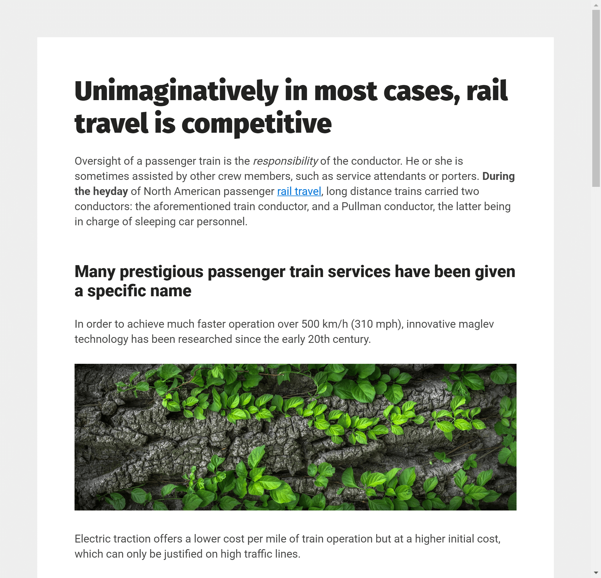

# Perfect text format

*Version 1.1*

This is a serious attempt to create the perfect text format for readability.

- [Demo - JSFiddle](https://jsfiddle.net/w4hftLpm/1/)
- [Demo - JS Bin](https://jsbin.com/hoguqodebo/edit?output) (works on mobile)



## In short

- Neutral feeling, not branded in any way.
- The most common content tags are supported.
- Perfect balanced colors for eye comfort.
- Maximum readability because of perfect font families, letter spacings and line heights.
- Maximum scanability because of perfect spaces between elements (paddings/margins).
- Maximum responsiveness because of fluid font sizes.

If you disagree, [add an issue](https://github.com/jenstornell/perfect-text-format/issues/new).

## Usage

1. Download the  [css file](https://raw.githubusercontent.com/jenstornell/perfect-text-format/master/assets/css/dist/style.min.css)
1. Add `<link rel="stylesheet" href="assets/css/dist/style.min.css">` to your head.
1. Create `<div class="format-text"></div>` and add some content.
1. Done!

If it does not work as expected, your other styles are probably overwriting the styles of this file.

## Tags supported

```text
a b blockquote br cite code i img em h1 h2 h3 h4
li ol p pre strong table td th ul
```

## FAQ

### It there a perfect text format?

It's probably debatable, but I think it is. Take away everything that has to do with branding. What do we have left? Readability!

- Is a font size of 16px more readable than 10px? **Yes!**
- Is the color #333 more readable than #ccc? **Yes!**

Fine tune every little value like this and we will eventually get the perfect text format. For readability that is, not for brandning.

### Why use Google fonts?

- They are common and free
- They are beautiful and are placed on a fast CDN
- It's possible to download them and host them yourself if needed
- I don't need to host the fonts with the repo

### Why not use Bootstrap or other frameworks?

[Bootstrap](https://getbootstrap.com/) and other frameworks has a lot of stuff. Most of the things is not needed. This repo only covers the things that has to do with the text content.

## Libraries used

- [Boom Lorem Ipsum](https://www.boom-online.co.uk/lorem-ipsum/)
- [Colors - The New Defaults](https://clrs.cc/)

## Donate

Donate to [DevoneraAB](https://www.paypal.me/DevoneraAB) if you want.

## License

MIT